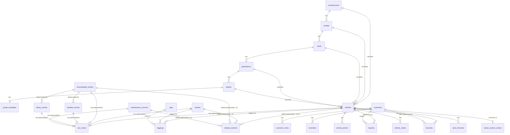

# er_diagram.md — ER図

## 1. Purpose（目的）

architecture/domain_model.md で概念レベルに整理したエンティティを、実際のデータベーステーブルとして設計する。テーブル名・カラムは英語のsnake_case（PostgreSQL/Supabaseの標準的な命名）で統一し、Claude Codeがそのままマイグレーションファイルを生成できる粒度とする。各テーブルの詳細カラム定義は `table_definitions.md` で行い、本ドキュメントはテーブル間の関係（ER図）に特化する。

## 2. Scope（対象範囲）

architecture/bounded_context.md で定義した全8コンテキストに属する全テーブルと、テーブル間の外部キー（参照）関係を対象とする。

## 3. テーブル一覧とコンテキスト対応

| コンテキスト | テーブル名                                                                                                                                         |
| ------------ | -------------------------------------------------------------------------------------------------------------------------------------------------- |
| Inventory    | `manufacturers`, `models`, `series`, `generations`, `grades`, `grade_templates`, `vehicles`, `vehicle_photos`, `vehicle_videos`, `price_histories` |
| Knowledge    | `encyclopedia_entries`, `timeline_events`, `library_entries`                                                                                       |
| Content      | `articles`, `maintenance_records`                                                                                                                  |
| Archive      | `owner_archive_entries`                                                                                                                            |
| CRM          | `customers`, `inquiries`, `customer_notes`, `reminders`                                                                                            |
| Engagement   | `favorites`                                                                                                                                        |
| SEO/Meta     | `seo_metas`, `related_contents`, `redirects`, `tags`, `taggings`                                                                                   |
| Audit        | `audit_logs`                                                                                                                                       |

## 4. ER図（Mermaid記法）

**注記**：`seo_metas` と `related_contents` は「ポリモーフィック関連」（対象テーブル名＋対象IDで、複数のテーブルから共通の1つのテーブルを参照する方式）とする。これによりSEO・関連コンテンツの仕組みをコンテンツ種別ごとに重複実装しない（BR-URL-003、bounded_context.md 4章-5）。

## 5. 主要な関係性の補足説明

### 5.1 車両階層マスタ（manufacturers 〜 grades）

- 上位から下位への1:多の階層構造（05_glossary.md 3章に対応）
- `vehicles` テーブルは、この階層の**該当する各レベルのIDを直接保持**する（例：`vehicles.grade_id`）。将来的にシリーズや世代が存在しない車種にも対応できるよう、`series_id` 以下は **NULL許容** とする
- `grade_templates` は `grades` に対して1:0または1:1（グレードごとにテンプレートが0または1つ存在）

### 5.2 vehicles を起点とする関連

- `vehicle_photos` / `vehicle_videos` / `price_histories` は `vehicles.id` を外部キーとして持つ1:多の子テーブル
- `price_histories` は追記専用（Append Only）。`vehicles.price` の更新と同時に必ず1レコード追加される（BR-HIST-001）
- `owner_archive_entries` は `vehicles.id` に対して0または1（売約済になって初めて作成される）

### 5.3 ポリモーフィック関連（seo_metas / related_contents / taggings）

- `seo_metas` は `target_type`（例："vehicle", "article", "encyclopedia_entry" 等）＋ `target_id` の組み合わせで、どのコンテンツに紐づくかを表現する
- `related_contents` は `from_type` + `from_id` → `to_type` + `to_id` の組み合わせで、あらゆるコンテンツ種別間の相互参照を表現する（BR-DOM-004：参照のみ、コピーしない）
- `taggings` は `tags` と対象コンテンツ（`taggable_type` + `taggable_id`）の中間テーブル

### 5.4 CRM関連

- `customers` を起点に `inquiries` / `customer_notes` / `reminders` が1:多で紐づく
- `favorites` は本来「ユーザー（サイト訪問者）」に紐づくが、初期リリースでは会員登録機能がないため、匿名セッション識別子で管理し、問い合わせ発生時に `customers` と紐付け直せる構造とする（table_definitions.md で詳細化）

### 5.5 Knowledge系ドメインの独立性

- `encyclopedia_entries` / `timeline_events` / `library_entries` は、`vehicles` への外部キーを**持たない**（BR-DOM-001〜003）
- 図鑑項目と在庫車両の関連付けは、`related_contents`（ポリモーフィック関連）経由で行う。これにより「対応する在庫車両がなくても図鑑項目が成立する」という要件を、DB制約レベルでも保証する

## 6. Acceptance Criteria（本ドキュメントの受け入れ基準）

- [ ] architecture/domain_model.md の全エンティティが、いずれかのテーブルとして表現されている
- [ ] BR-DOM-001〜004（ドメイン独立性）が、外部キー制約の設計として矛盾なく反映されている（Knowledge系テーブルがVehicleへの直接FKを持たない）
- [ ] BR-URL-003（SEOメタの個別保持）がポリモーフィック関連として実現されている
- [ ] 本ドキュメントの内容が、次工程 `table_definitions.md` でそのままカラム定義に落とし込める粒度である
